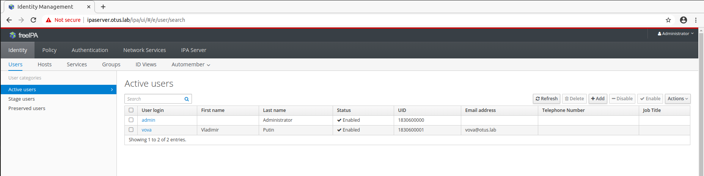
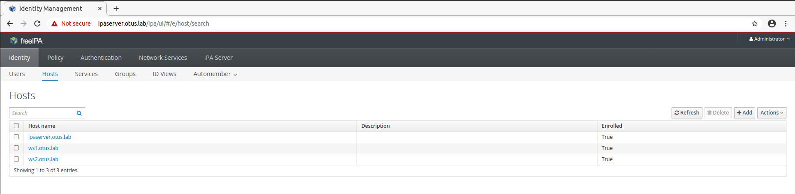
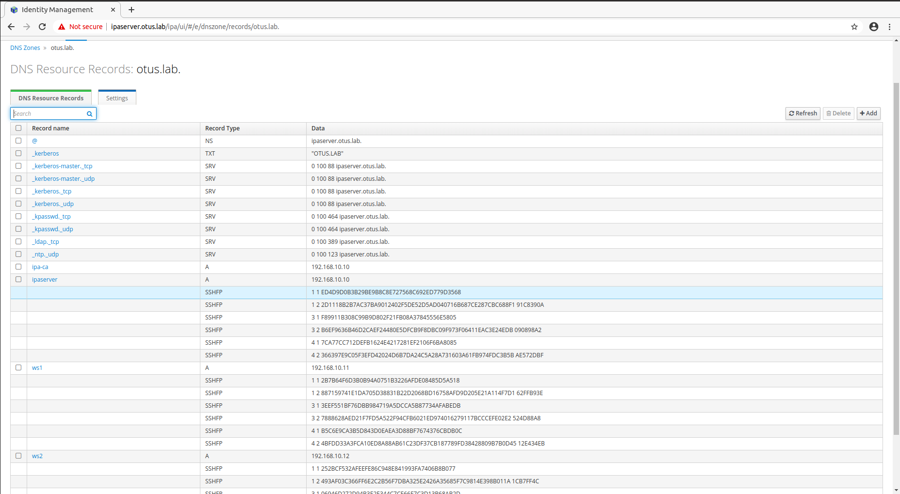

### Задание

1. Установить FreeIPA;
2. Написать Ansible playbook для конфигурации клиента;
3. \* Настроить аутентификацию по SSH-ключам;
4. ** Firewall должен быть включен на сервере и на клиенте.

### Выполнение задания

В результате выполнения ДЗ были написаны две ansible-роли, которые конфигурируют хост `ipaserver` в качестве FreeIPA сервера и вводят в домен `otus.lab` хосты `ws1` и `ws2`, создают пользователя `vova`, которому разрешено логиниться на хосты в домене с помощью публичного ключа ssh. Firewall при этом включен и на сервере, и на клиенте.

***Результат на скриншотах:***







***Проверка аутентификации по SSH-ключу:***

```
[vagrant@ws1 ~]$ ssh -i ./otus_lab_ssh_key vova@ws2.otus.lab
Creating home directory for vova.
[vova@ws2 ~]$ pwd
/home/vova
[vova@ws2 ~]$ whoami
vova
[vova@ws2 ~]$ logout
Connection to ws2.otus.lab closed.
[vagrant@ws1 ~]$ ssh -i ./otus_lab_ssh_key vova@ipaserver.otus.lab
Creating home directory for vova.
[vova@ipaserver ~]$ pwd
/home/vova
[vova@ipaserver ~]$ whoami
vova
```

### Проверка задания

1. Выполнить `vagrant up`.
2. Зайти в web-gui по адресу `http://192.168.10.10/`, логин для входа - `admin`, пароль - `psswrd$@!`
3. Для проверки аутентификации по ключам выполнить `vagrant ssh ws1` или `vagrant ssh ws2`, затем попробовать залогиниться на соседний хост (ключи лежат в домашней директории пользователя `vagrant`).

